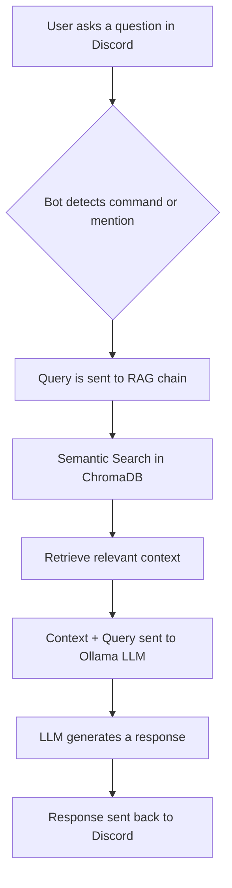

# Discord RAG Chat Bot

This is a sophisticated Discord AI chatbot that uses a Retrieval-Augmented Generation (RAG) architecture to provide context-aware responses. It leverages local AI models through Ollama, ensuring privacy and reducing reliance on external services.

 <!-- Replace with an actual demo GIF -->

## ✨ Features

- **🧠 Context-Aware AI:** Utilizes a RAG pipeline to answer questions based on a local knowledge base, providing more accurate and relevant answers.
- **🏠 Local First & Private:** Powered by Ollama for local LLM inference, keeping your data private and secure. No need for expensive cloud services.
- **🤖 Discord Integration:** Operates as a standard Discord bot with command and mention-based interactions.
- **🛠️ Core Commands:** Includes general commands (`!help`, `!ping`), admin commands (`!kick`, `!ban`), and AI commands (`!chat`).
- **👋 Event Handling:** Features handlers for member joins, messages, and bot readiness.
- **💾 Persistent Storage:** Uses ChromaDB for efficient vector storage and SQLite for conversation history.
- **🧩 Extensible & Modular:** Built with a clean, organized structure that is easy to maintain and extend.

## ⚙️ How It Works

The bot processes user queries by searching a local vector database (ChromaDB) for relevant information from its knowledge base. This context is then combined with the user's question and sent to a local Large Language Model (LLM) via Ollama.



**Data Flow:**
1.  **Knowledge Ingestion:** Documents in `data/` are chunked, embedded, and stored in ChromaDB. This is done via `update_vectorstore.py`.
2.  **Query Detection:** The bot listens for commands (`!chat`) or mentions (`@bot`).
3.  **Semantic Search:** The user's query is converted into a vector to find the most relevant text chunks from the knowledge base.
4.  **Contextual Prompting:** The retrieved text chunks are inserted into a prompt template along with the original question.
5.  **LLM Response:** The complete prompt is sent to the Ollama-hosted LLM, which generates a final, context-aware response.
6.  **Response Delivery:** The bot sends the generated answer back to the Discord channel.

## 🚀 Getting Started

Follow these instructions to get a local copy up and running.

### Prerequisites

- Python 3.10+
- [Ollama](https://ollama.com/) installed and running.
- A Discord Bot Token.

### Installation

1.  **Clone the repository:**
    ```sh
    git clone https://github.com/your-username/demo-chat-bot.git
    cd demo-chat-bot
    ```

2.  **Install Python dependencies:**
    ```sh
    pip install -r requirements.txt
    ```

### Configuration

1.  **Set up the Ollama model:**
    Pull the model you intend to use (the default is `llama3:8b`).
    ```sh
    ollama pull llama3:8b
    ```

2.  **Create a `.env` file:**
    Create a `.env` file in the root of the project and add the following variables:
    ```env
    # Your Discord bot token from the Discord Developer Portal
    DISCORD_TOKEN=your_discord_bot_token

    # The URL of your Ollama server
    OLLAMA_HOST=http://localhost:11434

    # The Ollama model to use for generating responses
    OLLAMA_MODEL=llama3:8b

    # The ID of the channel where welcome messages should be sent
    WELCOME_CHANNEL_ID=your_welcome_channel_id
    ```

### Running the Bot

1.  **Update the Vector Store:**
    Before the first run, populate the vector database with your knowledge base content.
    ```sh
    python update_vectorstore.py
    ```

2.  **Start the bot:**
    ```sh
    python bot.py
    ```

## 💬 Usage

Once the bot is running and connected to your Discord server, you can interact with it in two ways:

-   **Chat Command:** Use the `!chat` command followed by your question.
    ```
    !chat What is the main purpose of this project?
    ```
-   **Bot Mention:** Mention the bot at the beginning of your message.
    ```
    @YourBotName What is the main purpose of this project?
    ```

## 📂 Project Structure

```
/
├── commands/         # Discord command cogs (admin, ai, general)
├── data/             # Knowledge base files (e.g., knowledge.txt)
├── events/           # Discord event handlers (on_ready, on_message)
├── logs/             # Bot logs
├── rag/              # RAG pipeline implementation
│   ├── vectorstore/  # ChromaDB persistent storage
│   ├── data_loader.py
│   ├── embeddings.py
│   ├── rag_chain.py
│   └── vectorstore.py
├── utils/            # Utility scripts (database, logger)
├── bot.py            # Main bot entry point
├── requirements.txt  # Python dependencies
├── update_vectorstore.py # Script to update the vector store
└── README.md         # This file
```

##🤝 Contributing

Contributions are welcome! Please feel free to submit a pull request or open an issue.

## 📄 License

This project is licensed under the MIT License. See the [LICENSE](LICENSE) file for details.
